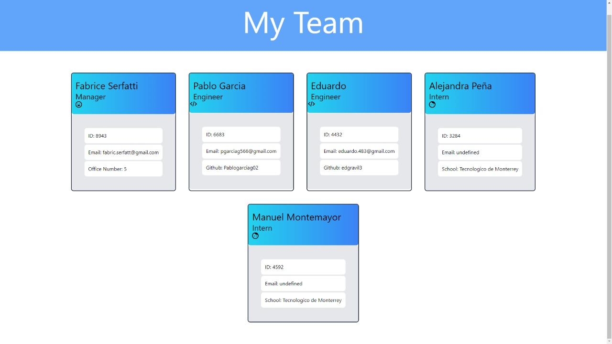

# Team-Profile-Generator

# Gihub Repository
https://github.com/Pablogarciag02/Team-Profile-Generator

## Youtube Link

## About this Project
-It is crucial for every team to establish who does what and what their role is.

-Due to this, i developed a Team-Profile-Generator. Through several prompts, a manager is able to create an html page that contains the information of each team member and their roles.

-This in turn makes it easy for a manager to manage their team and for team members to know what their role is.

This project uses
[Jest](https://www.npmjs.com/package/jest) for running the unit tests
[Inquirer](https://www.npmjs.com/package/inquirer)

Generate an HTML with the info of each worker.

## Table of Contents
-Installation
-Credits
-Licence
-Features
-Contribution

### Installation
*Step 1*: Then install inquirer by writing the following in the command terminal `npm i inquirer --save`

*Step 2*: Then run the `index.js` file in the command terminal and answer the prompts that will appear with your project information. 

*Step 3*: Then open, ./dist/index.html to see your webpage that was created.

*Step 4*: Do whatever you want with the generated webpage. (^-^)

### Credits
Pablo Eugenio Garcia
Github: [Pablogarciag02](https://github.com/Pablogarciag02)
LinkedIn: [Pablo-Eugenio-Gacía](https://www.linkedin.com/in/pablo-garc%C3%ADa-08842621b/)

## Licence
MIT License

Copyright (c) 2022 Pablo Eugenio Garcia

Permission is hereby granted, free of charge, to any person obtaining a copy
of this software and associated documentation files (the "Software"), to deal
in the Software without restriction, including without limitation the rights
to use, copy, modify, merge, publish, distribute, sublicense, and/or sell
copies of the Software, and to permit persons to whom the Software is
furnished to do so, subject to the following conditions:

The above copyright notice and this permission notice shall be included in all
copies or substantial portions of the Software.

THE SOFTWARE IS PROVIDED "AS IS", WITHOUT WARRANTY OF ANY KIND, EXPRESS OR
IMPLIED, INCLUDING BUT NOT LIMITED TO THE WARRANTIES OF MERCHANTABILITY,
FITNESS FOR A PARTICULAR PURPOSE AND NONINFRINGEMENT. IN NO EVENT SHALL THE
AUTHORS OR COPYRIGHT HOLDERS BE LIABLE FOR ANY CLAIM, DAMAGES OR OTHER
LIABILITY, WHETHER IN AN ACTION OF CONTRACT, TORT OR OTHERWISE, ARISING FROM,
OUT OF OR IN CONNECTION WITH THE SOFTWARE OR THE USE OR OTHER DEALINGS IN THE
SOFTWARE.

## Features
Allows the user to create a team profile webpage, that takes in several diffeent options = `Engineer, Manager, Intern`

## Contribution
